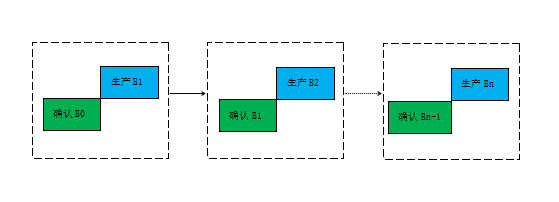
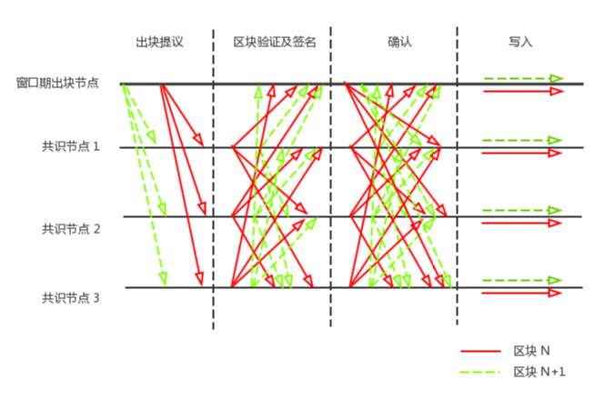

# PlatON CBFT(Concurrent Byzantine Fault Tolerance)	

<!-- START doctoc generated TOC please keep comment here to allow auto update -->
<!-- DON'T EDIT THIS SECTION, INSTEAD RE-RUN doctoc TO UPDATE -->
**Contents**

- [Consensus](#Consensus)
- [Introduction to CBFT](#Introduction%20to%20CBFT)
- [Theoretical Assumptions](#Theoretical%20Assumptions)
- [Block Generation](#Block%20Generation)
- [Block Verification](#Block%20Verification)
- [Block Execution](#Block%20Execution)
- [Writing to Blocks](#Writing%20to%20Blocks)
- [Flowchart](#Flowchart)

<!-- END doctoc generated TOC please keep comment here to allow auto update -->

## Consensus 

### Understanding Consensus Algorithms

Consensus, simply put, means that multiple participants are in agreement with each other on a certain topic. One real life example is a discussion in a meeting, another is the act of writing a business contract between two or more parties. In a blockchain system, each node needs to keep its ledger consistent with the ledgers on other nodes. In a traditional system architecture - which is a centralized system - each slave node can easily synchronize data from the master node, aligning the slave with the master. A real life analogy is how the boss of a company issues orders, which are then carried out by the employees of the company. A blockchain system however is a distributed network, and discussion is required to decide which among the nodes can issue valid orders.

Consensus algorithms aims to solve the core problem of how to make each node keep their data consistent with other nodes. By following the same rule, each node can verify their own data.

How do consensus algorithm rules work? They work by setting a series of conditions, and how well a node fulfills the conditions determines the chance it has to be elected as a representative, authoritative and trustworthy node.

#### CBFT

`Concurrent Byzantine Fault Tolerance` is used for building concurrent Byzantine fault tolerant systems. CBFT enables a `(n-1) / 3 ` fault tolerance while guaranteeing viability, security and efficiency. 
The main feature is support for concurrent block creation and consensus, greatly improving block creation rate, making it more feasible for High Frequence Trading (HFT).

**Advantages**

- High consensus efficiency to meet requirements of high frequency trading scenarios
- The time of consensus block creation can be dynamically adjusted down to one second, meeting commercial real-time processing requirements

## Introduction to CBFT

`CBFT` is short for `Concurrent Byzantine Fault Tolerance`, where Byzantine refers to the Byzantine Generals' Problem.
Upon creation of a new block, the producing node immediately broadcasts the block to other consensus nodes, which in turn sign the hash of the block after verification, and then broadcast to the network.
When any node receives 15 or more signatures, the block is considered an irreversible block.

## Theoretical Assumptions

In order to facilitate research, simplify complex problems, and at the same time grasp the nature of the problem, `CBFT` made some assumptions in design.

* Block broadcast delay time is less than the time interval for generating blocks

* Block replay time is less than (block time interval - block broadcast delay time)

## Block Generation

After the verifier generates blocks, the order of the proposed blocks will be determined according to certain rules. Each proposing node has `O` seconds to produce blocks, and each verifier will strictly follow the time window for producing blocks and verify that the blocks of other proposing nodes are legal.

**Assuming**

- `L`: the generation time (UTC time, milliseconds) of the last block in the previous iteration cycle;
- `N`: current system time (UTC time, milliseconds);
- `I`: the location of the current node among all sorted verifier accounting nodes;
- `n`: number of verifiers selected in each round;
- `p`: time window for each verification node to producing block, default 10 (seconds);
- `O`: The block production time window for each proposer (milliseconds)/2 - 1000; 
- `D`: average network delay (in milliseconds) for the current node and the producing node;

Then the current verification node determines whether it is in the block production window period like this:

    I * p * 1000 < (N - L) % (n * p * 1000) < (I + 1) * p * 1000

If the equation is correct, the `CBFT` consensus module will produce the next block based on the current highest legitimate block and broadcast it to other verifier nodes every `1` seconds.

## Block Verification

When a verification node receives a block proposed by another node, it first determines whether the block is legal, that is, whether it is necessary to further verify or if the block can be discarded.

### Block Legality Check

This block is considered legal if any of the following conditions are met (requires further verification):

    I * p * 1000 < (N - L - O) % (n * p * 1000) < (I + 1) * p * 1000
    I * p * 1000 < (N - L + O) % (n * p * 1000) < (I + 1) * p * 1000

If the above conditions are not met, the block is considered to be an illegal block and is discarded directly.

### Block Legitimacy Check

Block legality check is a coarse-grained decision-making process based entirely on time range. After the block legality check is completed, more detailed identification is needed to determine whether the block needs to be signed and broadcasted. A block is considered legitimate if it meets the following conditions: 

- The block is legal;
- The height of the current block matches the time window period of its author;
- The current block block creation time and the previous block time meet the block creation time interval requirement (`p * (1 +/- 10%)`);
- The highest irreversible block of the current node is the ancestor of the block;
- The current node has not signed other blocks of the same height;

If the above five conditions are met, the block is considered to be legitimate and needs to be signed and the signature broadcast.

## Block Execution

When a consensus node receives a new block, if it meets the requirements:

- The block is a legal block;
- The current highest irreversible block is the ancestor of the block;

Then it needs to:

* Execute the block;
* If it has previously received blocks that are descendant from the current block, then execute those descendant blocks;

## Writing to Blocks

When a block signature is collected to `2f + 1`, the block is confirmed:

* If the block height of the new confirmed block `>` current irreversible block height, and the current irreversible block is the block ancestor of the new confirmed block, then the new block becomes the new irreversible block. If a higher irreversible block is found among the descendants of the new irreversible block, then that block becomes the new highest irreversible block. After determining the highest irreversible block, the new irreversible block needs to be added to the chain, as well as all the blocks between it and the previous highest irreversible block.
* Bifurcation may occur if the new block height `<` the current irreversible block. A fork is formed when a confirmed block already on the chain that is connected to the new confirmed block is lower than the highest irreversible block. If this happens, a fork happens at the location of the confirmed block on the chain, and that block becomes the new highest irreversible block. Although the previous higher irreversible block has collected at least `n-f` signatures, it is further away from the genesis block and is therefore considered a fork. It is then necessary to determine whether the transactions on the blocks from the abandoned original irreversible block to the fork point should return to the `pending` queue.

## Flowchart

The above figure shows an approximate explanation of the steps in a `CBFT` implementation.

When a node is in a block production window, it can continuously produce multiple blocks. As shown in the figure, consider a scenario where a node inside the block producing window produces the blocks N and N+1. The blocks are packaged, signed and then broadcast to the other consensus nodes. When a consensus node receives a new block, it will perform block verification and signature verification. If the verifications pass, the block will be re-signed and the signed block will be broadcast again. All the consensus nodes will receive the data of the blocks N and N+1 continuously without waiting for the block N to be confirmed, and the N+1 block can be processed in parallel. When each consensus node has collected 3f+1 signatures, the block is confirmed.