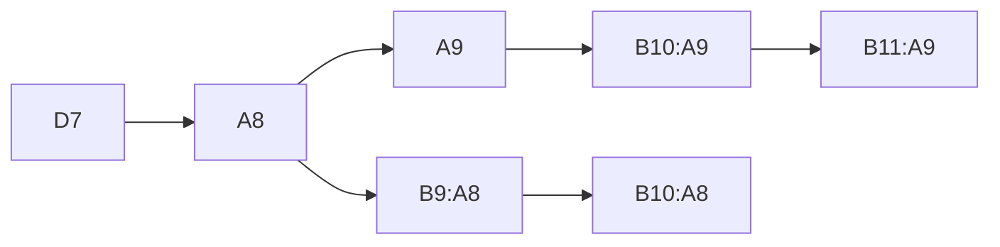
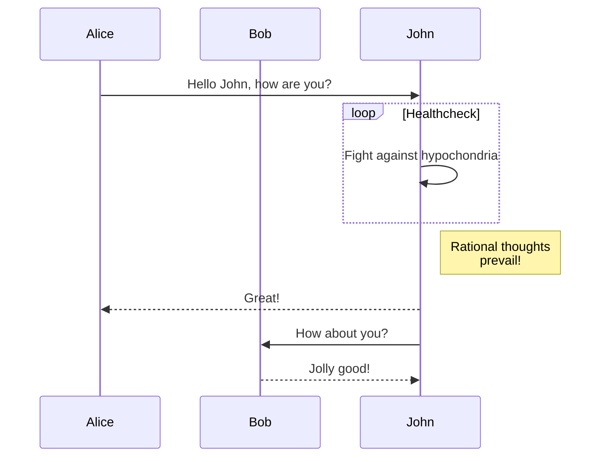
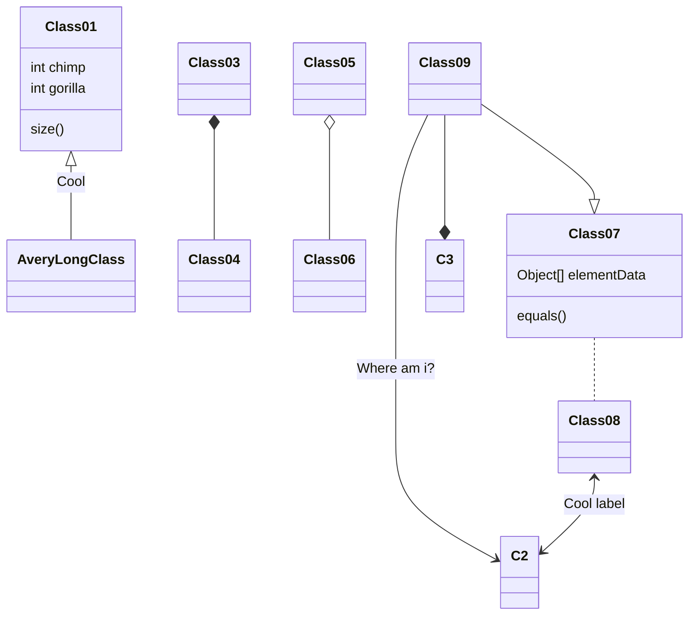

### 流程图



### 时序图



### 甘特图

```mermaid
gantt
    dateFormat  YYYY-MM-DD
    title Shop项目交付计划

    section 里程碑 0.1 
    数据库设计          :active,    p1, 2016-08-15, 3d
    详细设计            :           p2, after p1, 2d

    section 里程碑 0.2
    后端开发            :           p3, 2016-08-22, 20d
    前端开发            :           p4, 2016-08-22, 15d

    section 里程碑 0.3
    功能测试            :       p6, after p3, 5d
    上线               :       p7, after p6, 2d
    交付               :       p8, afterp7, 2d
```


### 类图



### GitGraph 


